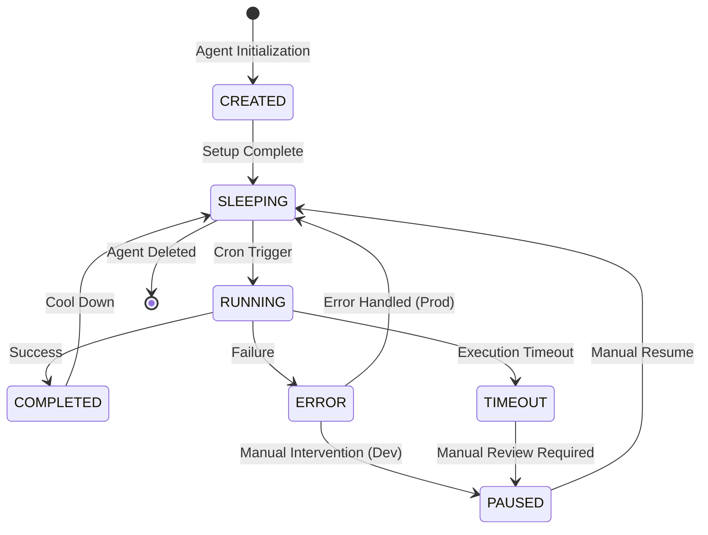
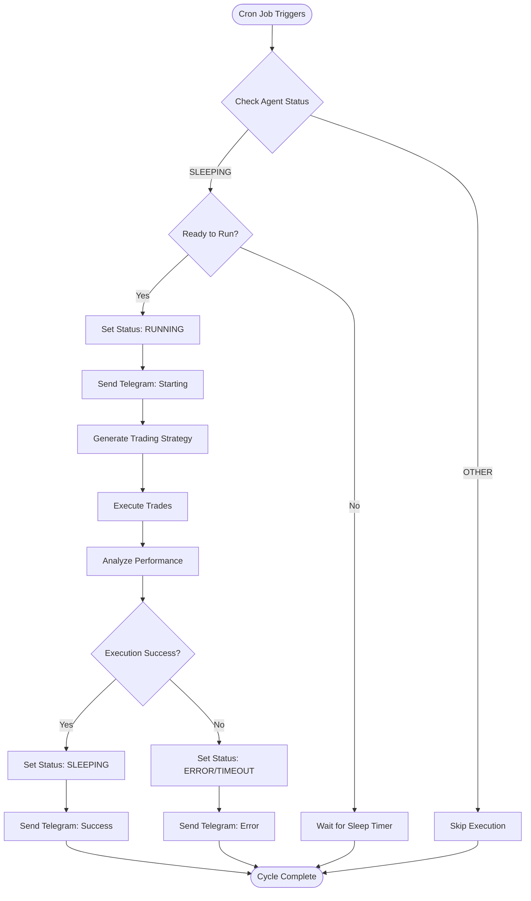
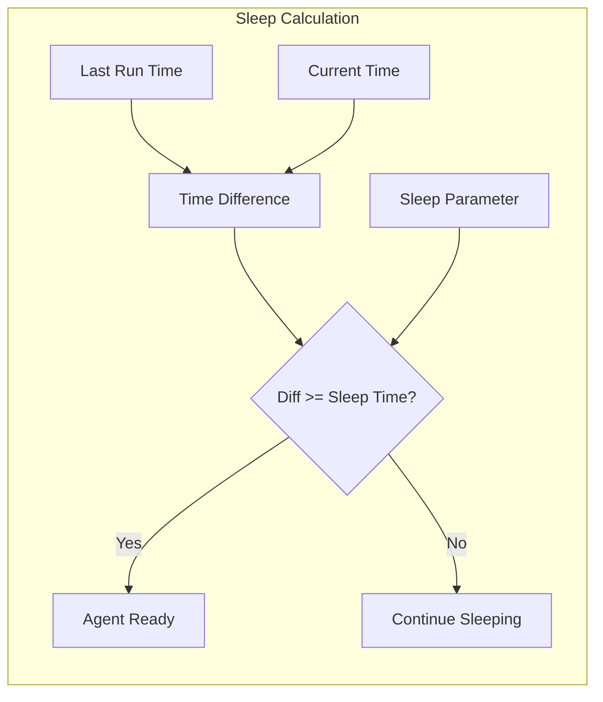
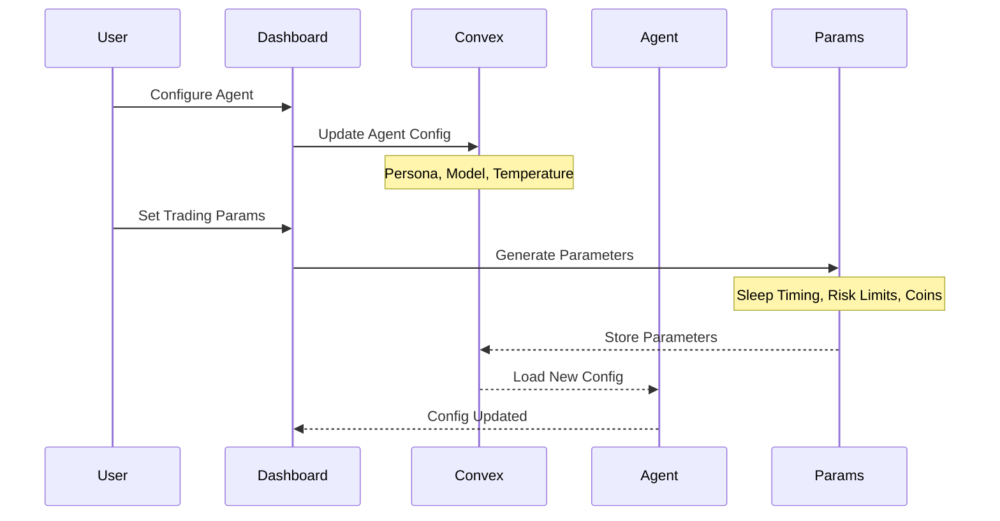
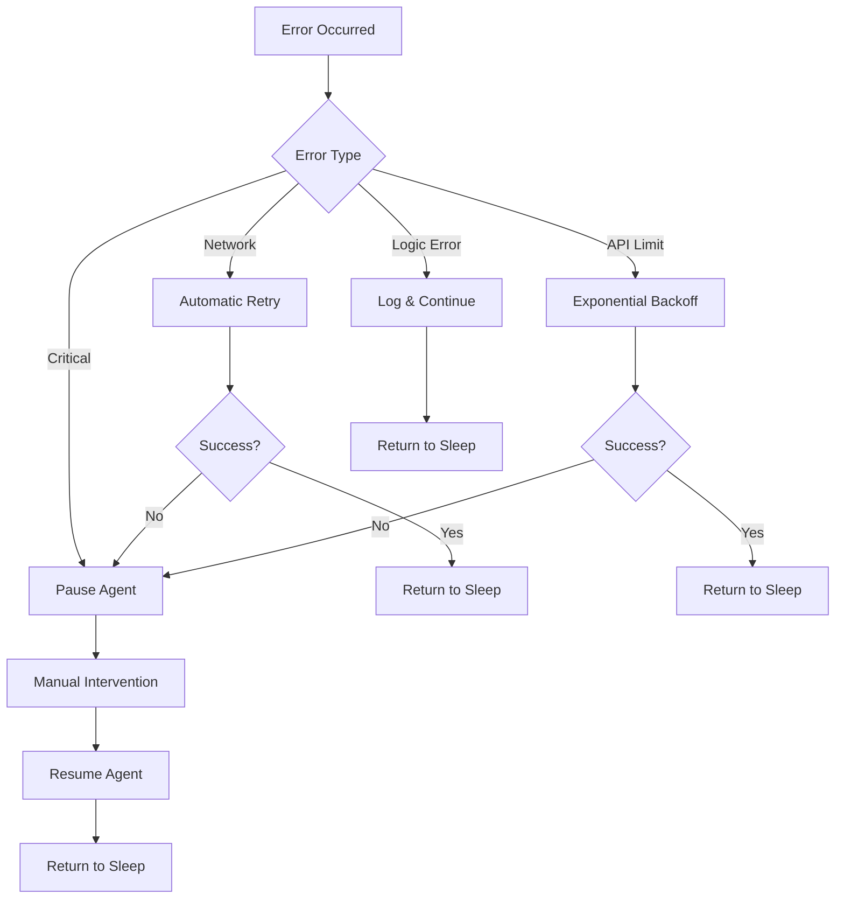
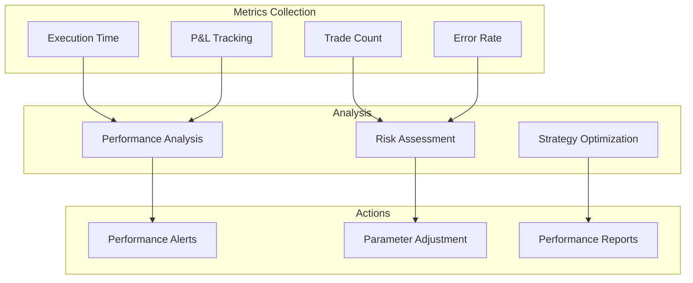

# Agent Lifecycle - Superior Agents v2

## Agent State Machine

## Detailed State Descriptions

### CREATED
- **Initial State**: Agent just created with configuration
- **Duration**: Instantaneous
- **Actions**: 
  - Generate wallet and private keys
  - Store encrypted credentials
  - Initialize agent parameters
- **Next State**: SLEEPING

### SLEEPING
- **Purpose**: Agent waiting for next execution cycle
- **Duration**: Based on `sleepTimeSecond` parameter (configurable)
- **Conditions**: 
  - Time since last run >= sleep duration
  - Agent has valid configuration
  - No manual pause
- **Next State**: RUNNING (when triggered by cron)

### RUNNING
- **Purpose**: Active trading execution phase
- **Duration**: Variable (typically 5-30 minutes)
- **Activities**:
  - Market research and analysis
  - Strategy generation via LLM
  - Trade execution
  - Performance analysis
- **Possible Outcomes**: COMPLETED, ERROR, TIMEOUT

### COMPLETED
- **Purpose**: Successful execution cycle
- **Duration**: Instantaneous transition
- **Actions**:
  - Store execution results
  - Update performance metrics
  - Send success notification
- **Next State**: SLEEPING

### ERROR
- **Purpose**: Execution failed with recoverable error
- **Behavior**:
  - **Production**: Auto-retry → SLEEPING
  - **Development**: Manual review → PAUSED
- **Actions**:
  - Log error details
  - Send error notification
  - Determine retry strategy

### TIMEOUT
- **Purpose**: Execution exceeded time limit
- **Actions**:
  - Cancel ongoing operations
  - Log timeout event
  - Require manual intervention
- **Next State**: PAUSED (requires manual review)

### PAUSED
- **Purpose**: Manual intervention required
- **Duration**: Until manually resumed
- **Triggers**:
  - Development environment errors
  - Timeout conditions
  - Manual pause by user
- **Next State**: SLEEPING (manual resume)

## Agent Workflow Execution

## Sleep Timer Logic

## Agent Configuration Flow

## Error Handling and Recovery

## Performance Monitoring

