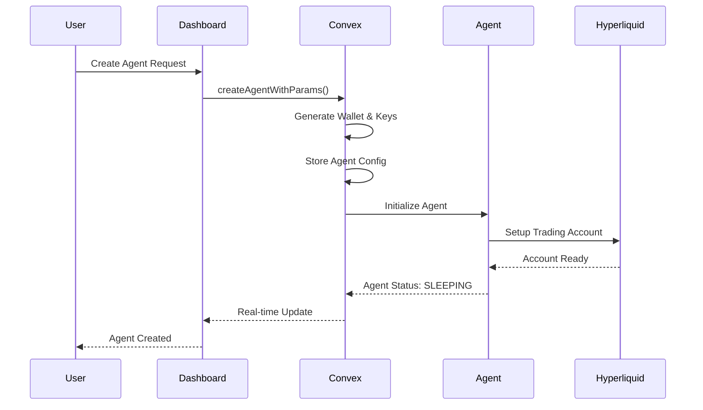
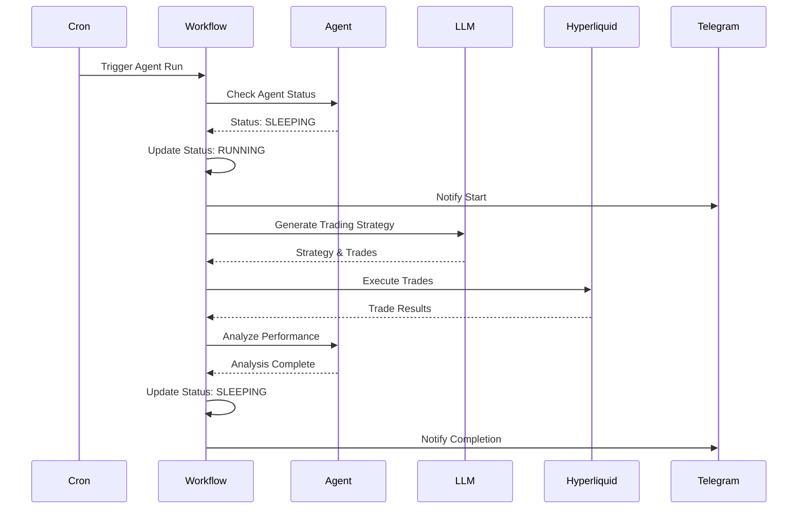
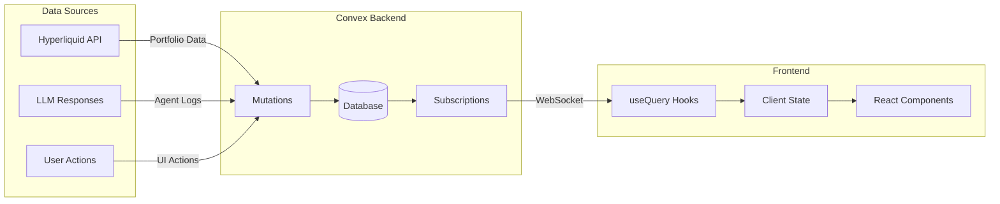
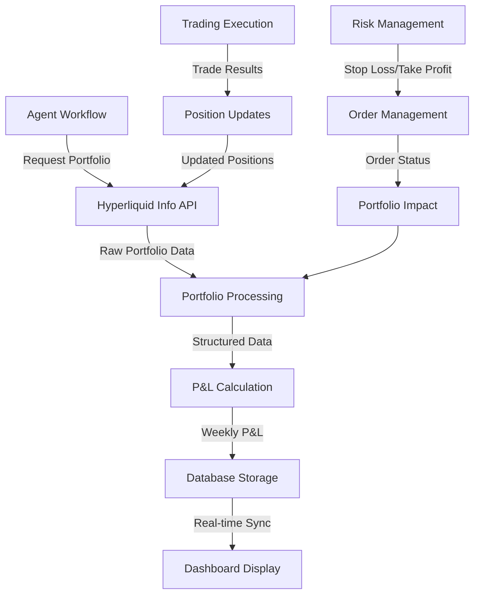
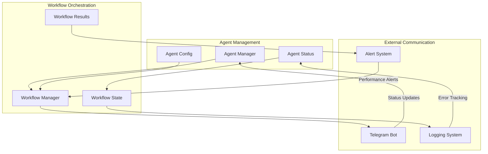
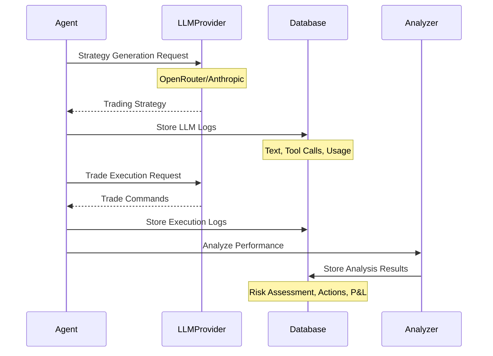

# Data Flow - Superior Agents v2

## Agent Creation Flow

## Trading Execution Flow

## Real-time Data Synchronization

## Portfolio Data Flow

## Agent Communication Flow

## LLM Integration Flow

