# Database Schema - Superior Agents v2

## Convex Database Structure

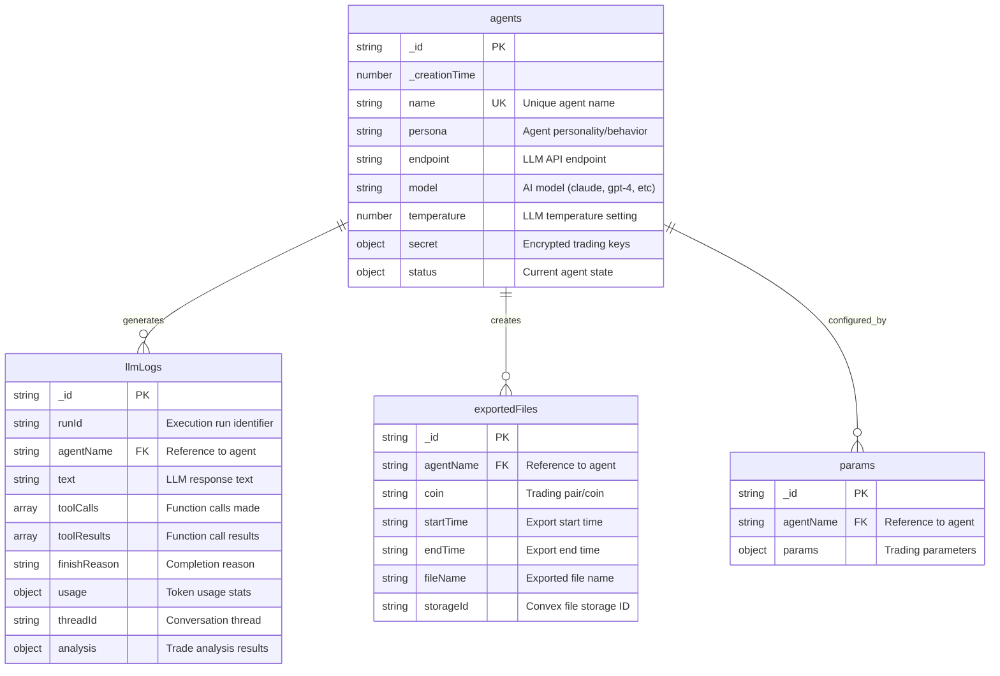

## Agent Schema Details

### Agent Status Object Structure
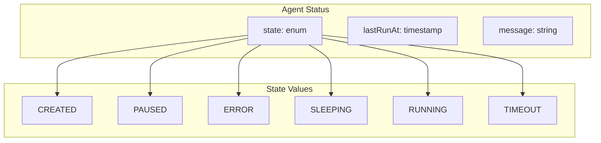

### Secret Object Structure
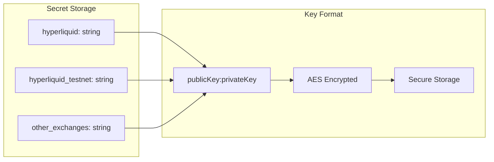

## LLM Logs Schema Details

### Analysis Object Structure
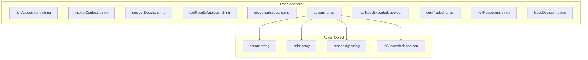

### Usage Object Structure
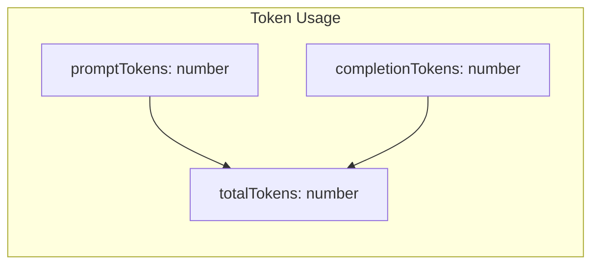

## Database Indexes

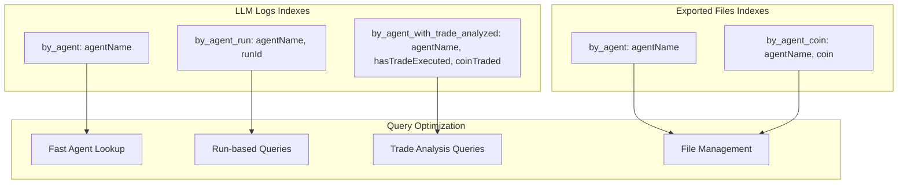

## Data Flow Through Database

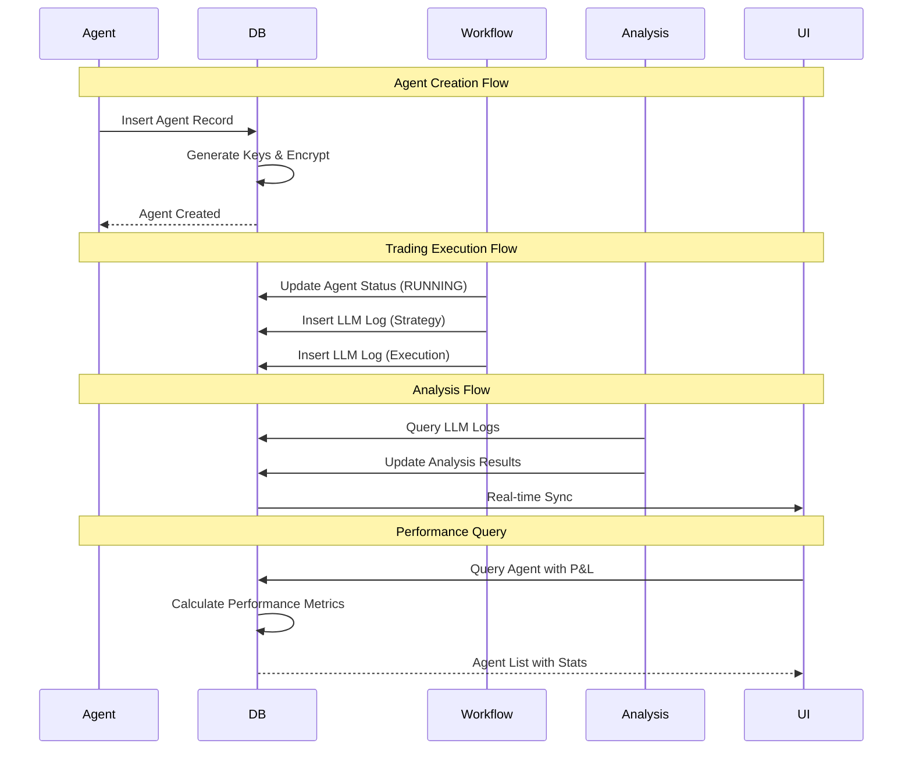

## Storage Patterns

### Real-time Data
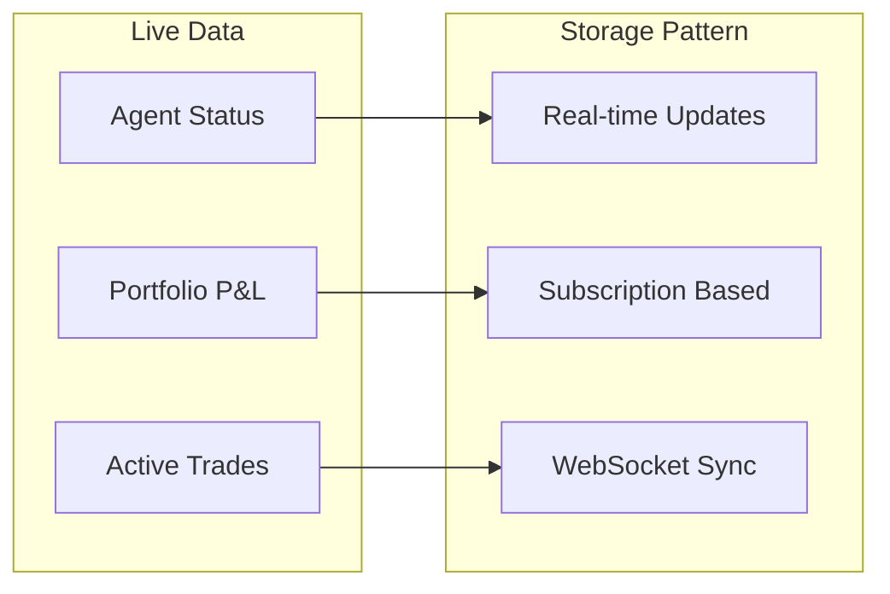

### Historical Data
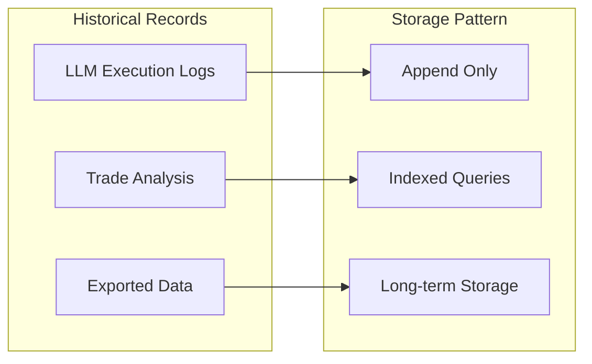

## Query Patterns

### Common Queries
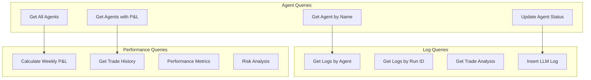

## Data Consistency

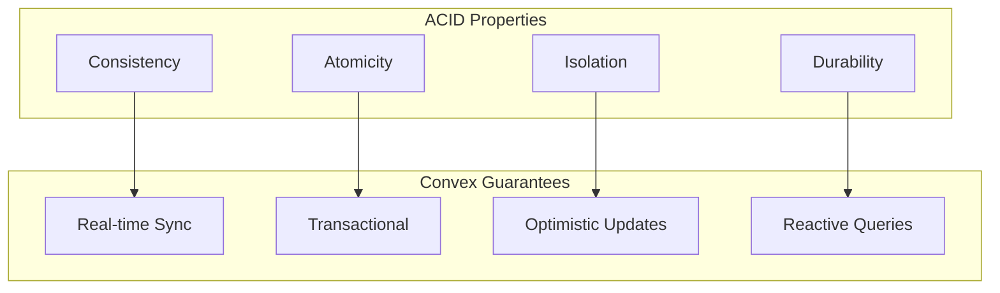