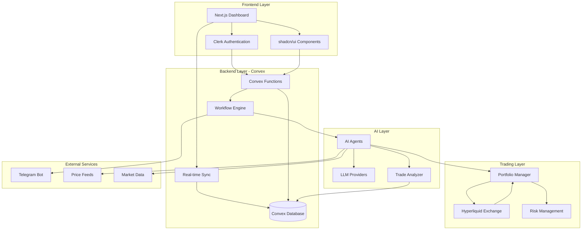
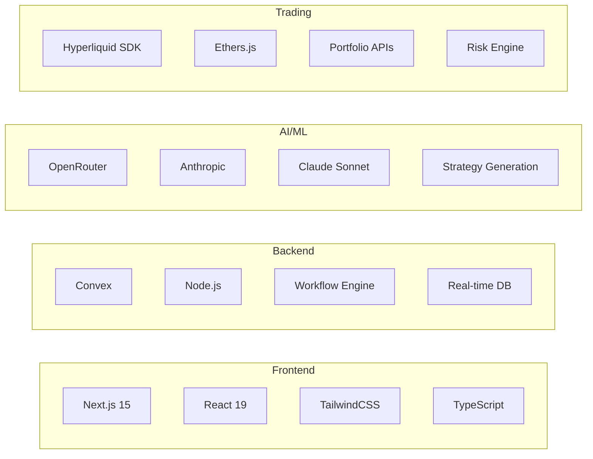

# System Architecture - Superior Agents v2

## High-Level Architecture Overview

## Component Details

### Frontend Layer
- **Next.js Dashboard**: Modern React 19 application with App Router
- **Clerk Authentication**: Secure user authentication with dark theme
- **shadcn/ui Components**: Consistent UI components built on Radix primitives

### Backend Layer (Convex)
- **Convex Database**: Real-time database with automatic synchronization
- **Workflow Engine**: Orchestrates complex trading operations with retry logic
- **Real-time Sync**: WebSocket connections for instant UI updates
- **Convex Functions**: Server-side logic for queries, mutations, and actions

### AI Layer
- **LLM Providers**: OpenRouter, Anthropic Claude for strategy generation
- **AI Agents**: Autonomous agents with configurable personas and models
- **Trade Analyzer**: Post-trade analysis and performance assessment

### Trading Layer
- **Hyperliquid Exchange**: Primary trading venue for perpetuals and spot
- **Portfolio Manager**: Real-time P&L tracking and position management
- **Risk Management**: Stop-loss, take-profit, and leverage controls

### External Services
- **Telegram Bot**: Real-time notifications and status updates
- **Price Feeds**: Market data from various sources
- **Market Data**: News and sentiment analysis for trading decisions

## Technology Stack

## Security Architecture

```mermaid
graph TB
    subgraph "Authentication"
        CLERK[Clerk Auth]
        JWT[JWT Tokens]
        RBAC[Role-Based Access]
    end

    subgraph "Key Management"
        ENCRYPT[Encrypted Storage]
        PRIV[Private Keys]
        WALLET[Wallet Generation]
    end

    subgraph "API Security"
        HTTPS[HTTPS/TLS]
        CORS[CORS Policy]
        RATE[Rate Limiting]
    end

    subgraph "Trading Security"
        SIGN[Transaction Signing]
        MULTI[Multi-sig Support]
        AUDIT[Audit Logging]
    end

    CLERK --> JWT
    JWT --> RBAC
    
    ENCRYPT --> PRIV
    PRIV --> WALLET
    
    HTTPS --> CORS
    CORS --> RATE
    
    SIGN --> MULTI
    MULTI --> AUDIT
```

