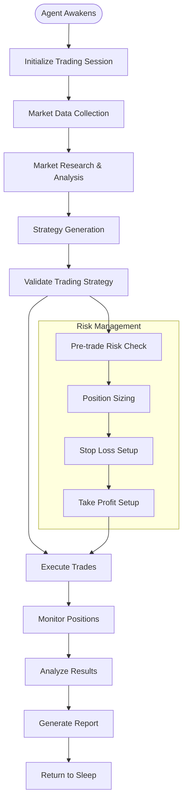
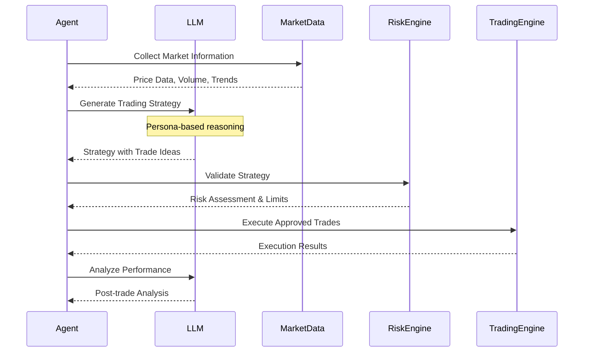
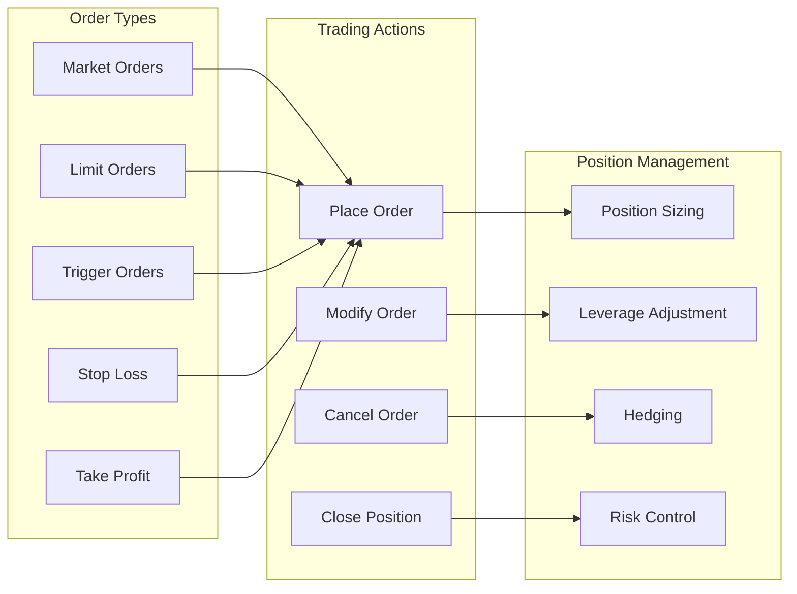
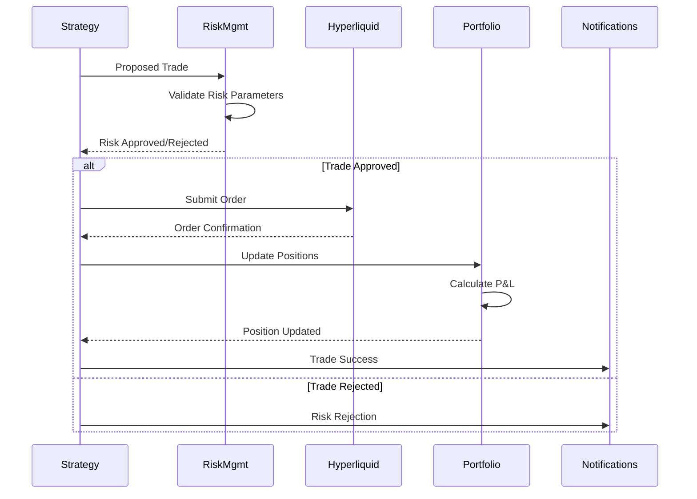
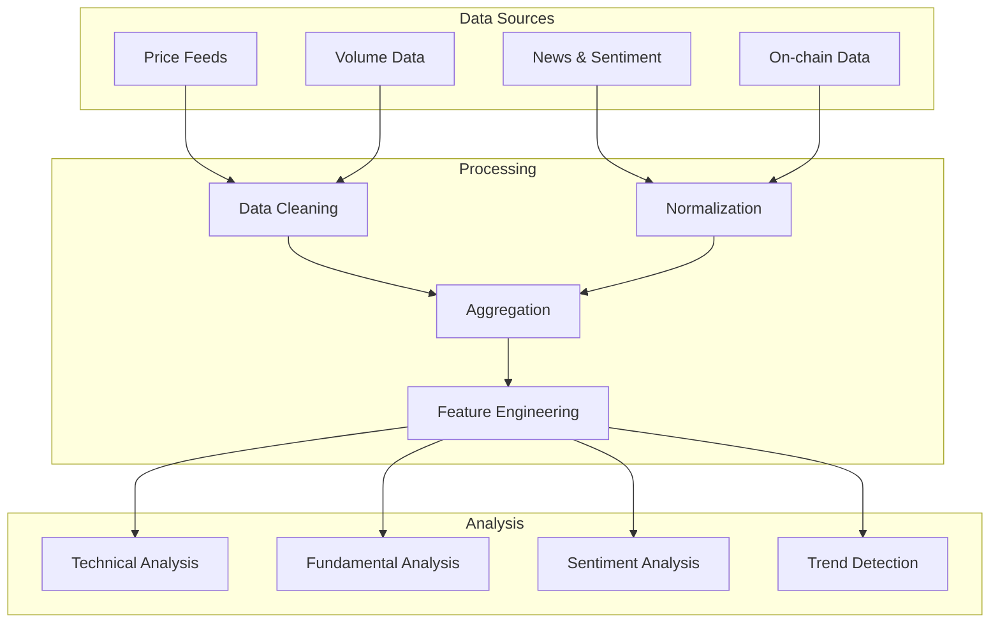
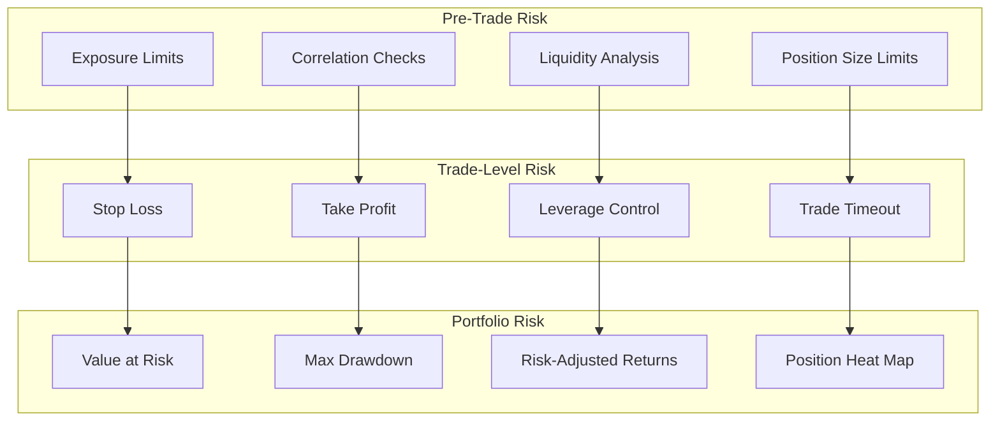
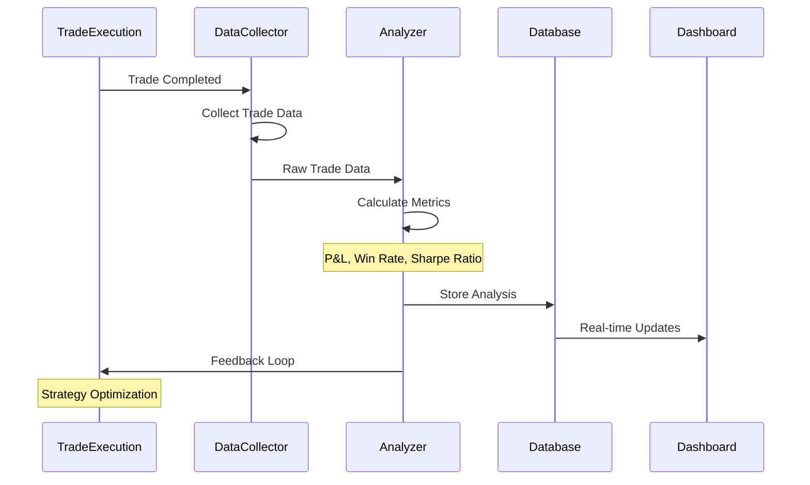
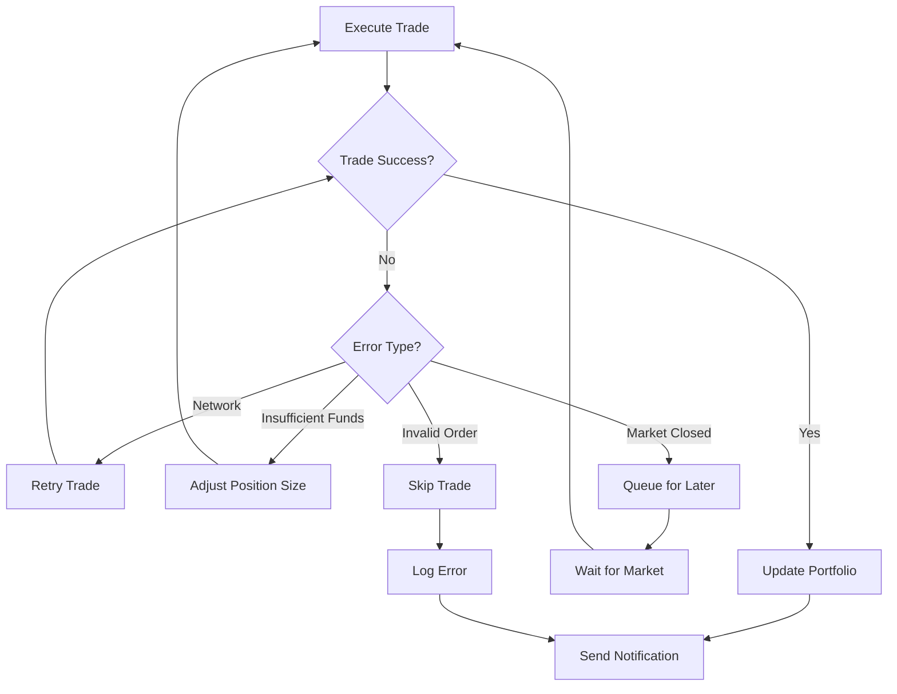
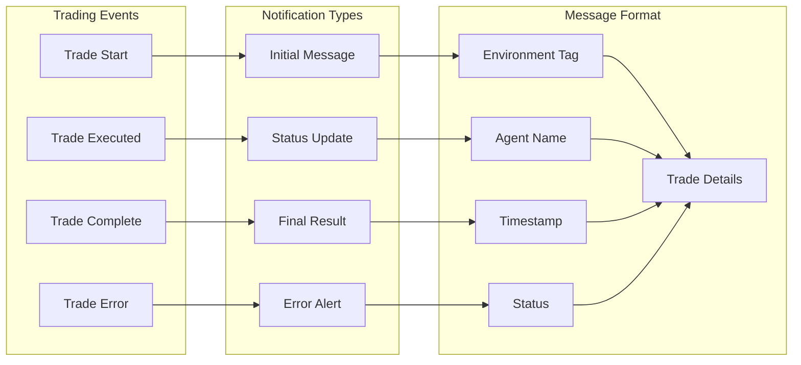
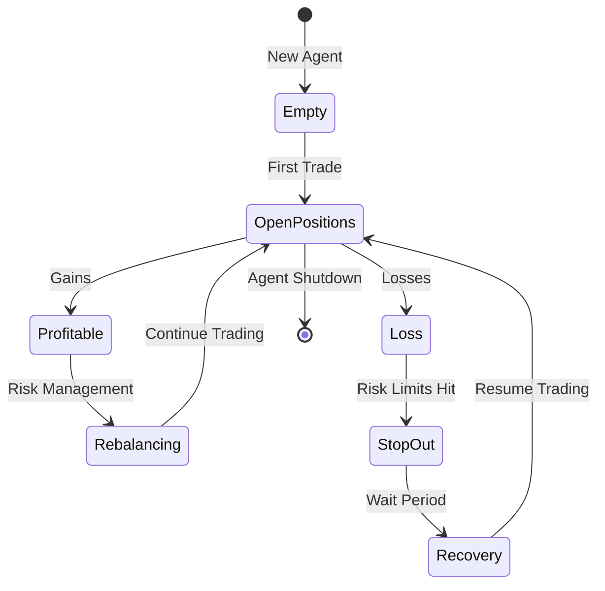

# Trading Workflow - Superior Agents v2

## Complete Trading Pipeline

## Strategy Generation Process

## Hyperliquid Trading Integration

## Trade Execution Workflow

## Market Data Pipeline

## Risk Management System

## Performance Analysis Pipeline

## Error Handling in Trading

## Telegram Notifications Flow

## Portfolio State Management

